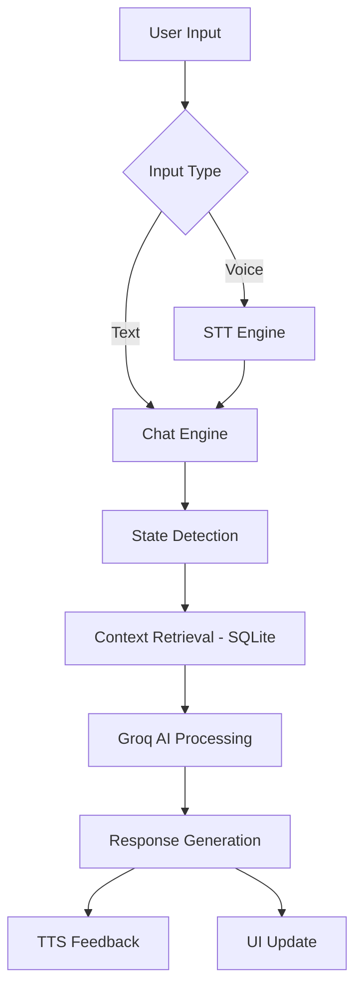

# AutiSense AI Application

AutiSense AI is a state-of-the-art mobile application built with React Native and Expo, designed to support neurodivergent individuals (specifically those on the autism spectrum) through AI-driven behavioral analysis, interactive chat, and structured scheduling.

## Key Features

- **AI-Powered Chat Engine**: Integrated with Groq (LLM) for empathetic and context-aware interactions. Supports both parent and child roles with tailored responses.
- **Behavioral State Detection**: Real-time analysis of user input to detect emotional states (e.g., overwhelmed, happy, routine-focused) and adjust AI behavior accordingly.
- **RAG-Lite Contextual Memory**: Uses a simplified Retrieval-Augmented Generation approach to remember user preferences (like favorite foods, toys) and past interactions via a local SQLite store.
- **Voice Integration**: Hands-free interaction via `expo-speech` for text-to-speech feedback and `@react-native-voice/voice` for voice-to-text input, enhancing accessibility.
- **Structured Scheduling**: A dedicated screen for managing daily routines, helping users maintain consistency and reduce anxiety.
- **Local SQLite Database**: All interactions, user profiles, and preferences are stored securely on-device using `expo-sqlite`, ensuring privacy and offline capability.

## Stability & Robustness

We have implemented critical stability measures to ensure a crash-free experience on Android and iOS:

### 1. Strict Boolean Sanitization
A custom `toBool` utility ensures that native bridge props (like `disabled`, `editable`) never receive invalid types (e.g., "true" strings or nulls). This directly prevents common `java.lang.ClassCastException: java.lang.String cannot be cast to java.lang.Boolean` errors on Android.

### 2. Global Runtime Guard
An automated console interceptor catches and surfaces native bridge casting errors before they can crash the application, providing immediate feedback during development and safe degradation in production.

### 3. Component-Level Error Boundaries
React Error Boundaries wrap the main navigation to provide a graceful fallback UI in case of unexpected failures, allowing users to "Try Again" without losing app state.

## Technical Architecture



## Technology Stack

- **Framework**: [React Native](https://reactnative.dev/) (v0.81.5) via [Expo](https://expo.dev/) (v54.0.33)
- **Navigation**: React Navigation (Stack)
- **AI Backend**: Groq API (LLM)
- **Database**: SQLite (Local)
- **State Management**: React Hooks (useState, useEffect)
- **Styling**: Vanilla React Native StyleSheet for maximum performance.

## Installation & Setup

1. **Clone the repository**:
   ```bash
   git clone "https://github.com/aounraza379/autisense-ai-application.git"
   cd autisense-ai-application
   ```

2. **Install dependencies**:
   ```bash
   npm install
   ```

3. **Configure Environment**:
   Create a `.env` file in the `AutiSenseAI` directory:
   ```env
   EXPO_PUBLIC_GROQ_API_KEY=your_groq_api_key_here
   ```

4. **Run the application**:
   - For Android: `npm run android`
   - For Expo Go: `npm start`

## In case of runtime (java error)

1. **Make sure Script is enabled on your system**:
   ```bash
   Set-ExecutionPolicy -Scope Process -ExecutionPolicy Bypass
   ```
2. **Run following commands**:
   ```bash
   npx expo install @react-navigation/native
   npx expo install @react-navigation/stack
   npx expo install react-native-screens react-native-safe-area-context react-native-gesture-handler
   ```
3. **Run and see app on expo go**:
   ```bash
   npx expo start -c
   ```

## Progress Update
- [x] Initial UI/UX Architecture
- [x] SQLite Integration (Session & Memory Storage)
- [x] AI Chat Engine with Real-time State Detection
- [x] Boolean Stability Audit & `toBool` Utility Implementation
- [x] Voice Integration (TTS & STT)
- [x] Global Error Boundary & Runtime Guards
- [x] Structured Scheduling System
- [ ] Phase 3: Comprehensive Testing & Bug Fixes (In Progress)